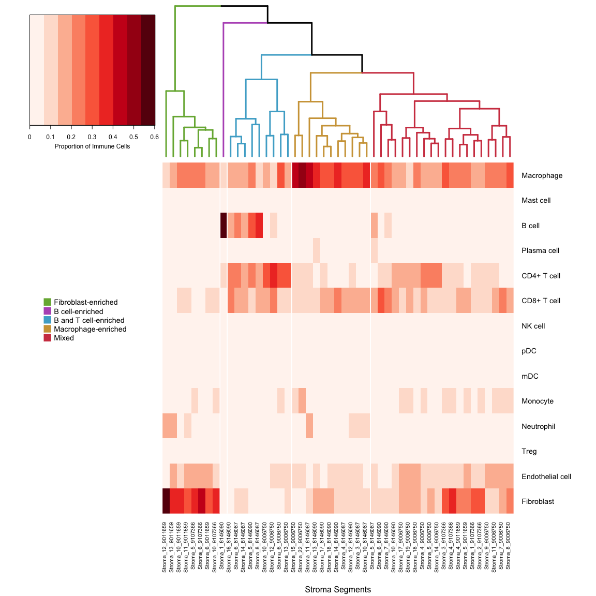
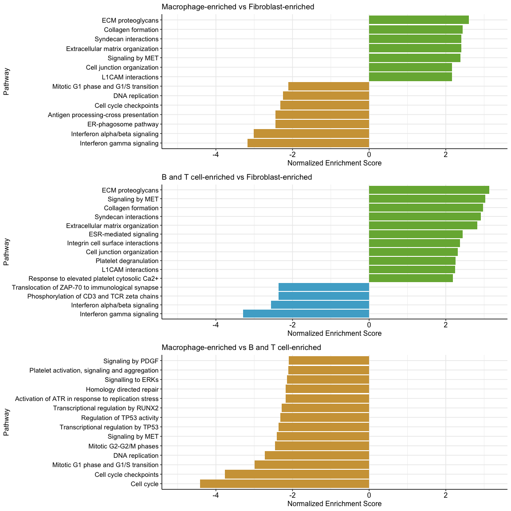
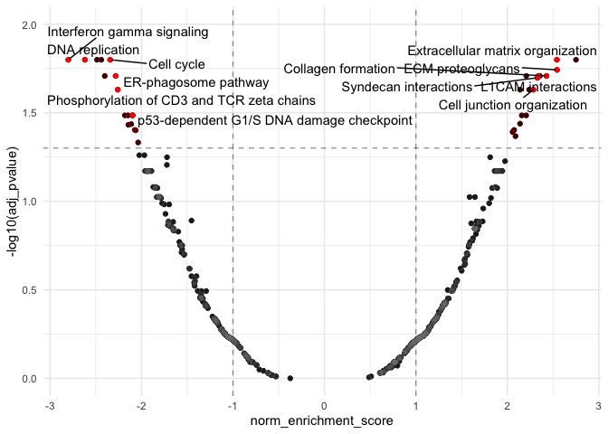

Pathway Enrichment Analysis
================
Jean-Baptiste Reynier
3/22/2021

## Proportion Immune

``` r
average_immune <- read.csv("data/immune_tumor_stroma.csv")

# colnames(average_immune)[1] <- "cell_type"

list_cell_types <- c("mast",
                     "plasma",
                     "pDCs",
                     "mDCs",
                     "monocytes.C",
                     "monocytes.NC.I",
                     "Treg",
                     "endothelial.cells")

average_immune <- average_immune[which(!(average_immune$cell_type %in% list_cell_types)),]
rownames(average_immune) <- NULL
average_immune$cell_type <- revalue(average_immune$cell_type,
                                          c("macrophages"="Macrophage",
                                            "B.memory"="B memory",
                                            "B.naive"="B naive",
                                            "T.CD8.memory"="CD8+ memory",
                                            "T.CD8.naive"="CD8+ naive",
                                            "T.CD4.memory"="CD4+ memory",
                                            "T.CD4.naive"="CD4+ naive",
                                            "NK"="NK cell",
                                            "neutrophils"="Neutrophil",
                                            "fibroblasts"="Fibroblast"))

bp <- ggbarplot(
  average_immune, x = "cell_type", y = "percent_immune", add = "mean_sd", 
  fill= "segment", palette = c("#0ABCBB", "#BC0A0B"),
  position = position_dodge(0.8),
  xlab = "Cell Type",
  ylab = "Proportion Immune",
  legend.title = "Region"
  )


stat.test <- average_immune %>%
  group_by(cell_type) %>%
  t_test(percent_immune ~ segment) %>%
  adjust_pvalue(method = "bonferroni") %>%
  add_significance("p.adj")

stat.test <- stat.test %>%
  add_xy_position(fun = "mean_sd", x = "cell_type")

stat.test$xmin <- c(1:10) - 0.2
stat.test$xmax <- c(1:10) + 0.2
stat.test$x <- c(1:10)

stat.test <- stat.test[which(stat.test$p.adj.signif != "ns"), ]

bp <- bp + stat_pvalue_manual(
  stat.test,  label = "p.adj.signif", tip.length = 0.01
) + rotate_x_text(angle = 50, vjust=1) + grids() + theme(text = element_text(size = 15))

# ggsave(bp, "prop_immune2.jpg", dpi = 500, width = 10, height = 7)

bp
```

<!-- -->

## Heatmap

``` r
cluster_celltype <- hclust(dist(t(deconv_immuneonly_percent)), method = "complete")
cluster_celltype_df <- as.data.frame(cutree(cluster_celltype, 5))
colnames(cluster_celltype_df) <- c("Cluster")
cluster_celltype_df$ROIName <- rownames(cluster_celltype_df)
# write.csv(cluster_celltype_df, "immune_clusters.csv", row.names = FALSE)
cluster_celltype_df$Cluster <- revalue(as.character(cluster_celltype_df$Cluster),
                                                c("4"="Fibroblast-rich",
                                                  "5"="B-cell-rich",
                                                  "2"="T-cell-B-cell-rich",
                                                  "3"="Macrophage-rich",
                                                  "1"="Mixed"))
# write.csv(cluster_celltype_df, "immune_clusters_updated.csv", row.names = FALSE)


# pdf(file="heatmap.pdf", height = 100, width = 200)
# jpeg(file="heatmap.jpg", width = 10, height = 5, units = 'in', res = 300)

heatmap.2(data.matrix(deconv_immuneonly_percent), Rowv = FALSE, col = brewer.pal(9,"Reds"),
          Colv=as.dendrogram(cluster_celltype) %>% 
            set("branches_k_color", value = as.vector(color_cluster$color[1:5]), k = 5) %>% 
            set("branches_lwd", 3), dendrogram = "column", density.info="none",
          trace="none", key.xlab="Proportion of Immune Cells", key.title = "",
          # labCol = FALSE,
          xlab = "Stroma Segments", margins = c(10, 10),
          labRow = revalue(row.names(deconv_immuneonly_percent),
                                                c("macrophages"="Macrophage",
                                                  "mast"="Mast cell",
                                                  "B"="B cell",
                                                  "plasma"="Plasma cell",
                                                  "CD4.T.cells"="CD4+ T cell",
                                                  "CD8.T.cells"="CD8+ T cell",
                                                  "NK"="NK cell",
                                                  "mDCs"="mDC",
                                                  "monocytes"="Monocyte",
                                                  "neutrophils"="Neutrophil",
                                                  "Treg"="Treg",
                                                  "endothelial.cells"="Endothelial cell",
                                                  "fibroblasts"="Fibroblast")),
          # labCol = FALSE,
          colsep = c(8, 9, 18, 29)
          )

legend(0, 0.5, xpd=TRUE,
  legend = c("Fibroblast-enriched", "B cell-enriched",
             "B and T cell-enriched", "Macrophage-enriched", "Mixed"), 
  col = c("#77b241", "#b759c0", "#4dadcf", "#d0a245", "#d14150"),
  pch = rep(c(15), times = 5),
  bty = "n", 
  pt.cex = 2, 
  cex = 0.9, 
  text.col = "black", 
  horiz = F , 
  inset = c(0.1, 0.1))
```

<!-- -->

## Enrichment Barplot

``` r
# Fibroblast vs Macrophage

fibro_macro_pathway_analysis <- read.csv("data/fibroblast_macrophage_pathway.csv", )
fibro_macro_pathway_analysis <- fibro_macro_pathway_analysis[which(fibro_macro_pathway_analysis$adj_pvalue < 0.05),]
fibro_macro_pathway_analysis$enrichment_positive <- fibro_macro_pathway_analysis$norm_enrichment_score > 0

p1 <- ggplot(data =fibro_macro_pathway_analysis,
       aes(x = reorder(pathway, norm_enrichment_score), y = norm_enrichment_score,
           fill = enrichment_positive)) +
  geom_bar(stat = "identity") + 
  scale_fill_manual(values = c("#d0a245", "#77b241")) +
  coord_flip() +
  # theme_minimal() +
  guides(fill = FALSE) + theme_pubr() + grids()  + ylim(-5, 3.2) + ylab("Normalized Enrichment Score") + xlab("Pathway") + ggtitle("Macrophage-enriched vs Fibroblast-enriched") + theme(text = element_text(size = 12), axis.text.y = element_text(size = 11), plot.title = element_text(size = 13))

# Fibroblast vs TCell

fibro_tcell_pathway_analysis <- read.csv("data/fibroblast_tcell_pathway.csv", )
fibro_tcell_pathway_analysis <- fibro_tcell_pathway_analysis[which(fibro_tcell_pathway_analysis$adj_pvalue < 0.05),]
fibro_tcell_pathway_analysis$enrichment_positive <- fibro_tcell_pathway_analysis$norm_enrichment_score > 0

p2 <- ggplot(data =fibro_tcell_pathway_analysis,
       aes(x = reorder(pathway, norm_enrichment_score), y = norm_enrichment_score,
           fill = enrichment_positive)) +
  geom_bar(stat = "identity") +
  scale_fill_manual(values = c("#4dadcf", "#77b241")) +
  coord_flip() +
  # theme_minimal() +
  guides(fill = FALSE) + theme_pubr() + grids() + ylim(-5, 3.2) + ylab("Normalized Enrichment Score") + xlab("Pathway") + ggtitle("B and T cell-enriched vs Fibroblast-enriched") + theme(text = element_text(size = 12), axis.text.y = element_text(size = 11), plot.title = element_text(size = 13))

# TCell vs Macrophage

macro_tcell_pathway_analysis <- read.csv("data/macrophage_tcell_pathway.csv", )
macro_tcell_pathway_analysis <- macro_tcell_pathway_analysis[which(macro_tcell_pathway_analysis$adj_pvalue < 0.05),]
macro_tcell_pathway_analysis$enrichment_positive <- macro_tcell_pathway_analysis$norm_enrichment_score > 0

p3 <- ggplot(data =macro_tcell_pathway_analysis,
       aes(x = reorder(pathway, norm_enrichment_score), y = norm_enrichment_score,
           fill = enrichment_positive)) +
  geom_bar(stat = "identity") +
  scale_fill_manual(values = c( "#d0a245", "#4dadcf")) +
  coord_flip() +
  # theme_minimal() +
  guides(fill = FALSE) + theme_pubr() + grids()  + ylim(-5, 3.2) + ylab("Normalized Enrichment Score") + xlab("Pathway") + ggtitle("Macrophage-enriched vs B and T cell-enriched") + theme(text = element_text(size = 12), axis.text.y = element_text(size = 11), plot.title = element_text(size = 13))

g1 <- ggplotGrob(p1)
g2 <- ggplotGrob(p2)
g3 <- ggplotGrob(p3)
g <- rbind(g1, g2, g3, size = "last")

g$widths <- unit.pmax(g1$widths, g2$widths, g3$widths)
# jpeg(file="grid_enrichment.jpg", width = 5.1, height = 6, units = 'in', res = 300)
grid.newpage()
grid.draw(g)
```

<!-- -->

## Volcano plots

``` r
list_pathways <- c("Extracellular matrix organization",
                   "Cell cycle",
                   "DNA replication",
                   "Interferon gamma signaling",
                   "ECM proteoglycans",
                   "ER-phagosome pathway",
                   "Collagen formation",
                   "L1CAM interactions",
                   "Syndecan interactions",
                   "Phosphorylation of CD3 and TCR zeta chains",
                   "Cell junction organization",
                   "p53-dependent G1/S DNA damage checkpoint")


pathway_analysis <- read.csv("data/pathway_analysis_cluster_4_6.csv", )
pathway_analysis$pathway <- as.character(pathway_analysis$pathway)
pathway_analysis$pathway <- lapply(pathway_analysis$pathway, function(x) {if (x %in% list_pathways) {x} else {""}})
ggplot(data=pathway_analysis, aes(x=norm_enrichment_score, y=-log10(adj_pvalue), label=pathway)) +
  geom_point() + theme(text = element_text(size = 20)) + 
  theme_minimal() +
  geom_vline(xintercept=c(-1, 1), col="black", linetype = "dashed", alpha=0.4) +
  geom_hline(yintercept=-log10(0.05), col="black", linetype = "dashed", alpha = 0.4) +
  geom_point(alpha = ifelse(pathway_analysis$pathway == "", 0.2, 1), color = ifelse(pathway_analysis$adj_pvalue > 0.05, "grey50", "red")) + ylim(0, 2) +
  geom_text_repel(max.overlaps = Inf)
```

<!-- -->
